# food App-:mortar_board:

Front End: ReactJS 
Instructions: 
1.used basic concepts of ReactJS 
2.used routing, redux 
3.wrote a clear & clean code with proper comments. 
4.used ui frameworks like bootstrap, material etc. 

Home Screen : 
* Restaurant Page with basic details like Name, location, phone number, must-try dishes, photos (scroll). Home page screen contains shimmer effect. 
* Home screen contains list of Recommended food and by using add button user can add that food to their cart. 
* Restaurant Page is static page. 

## `How to Run`   
1) git clone https://github.com/Himanshusinghofficial/Restaurant.git 
2) cd restaurant 
3) npm install 
4) npm start 

## `Made by: Himanshu Singh & Email:hs882677@gmail.com`

## `I Used` :smiley:  
1) React-Redux (FrontEnd) :heart: 
2) Materializecss/Css (Styling)  

## `Some ScreenShots` :camera:
### `Desktop View` :computer:

#### `Image 1-3: Shimmer Effect`

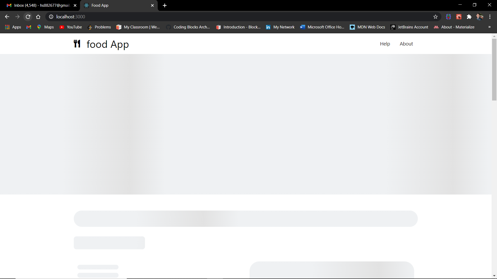

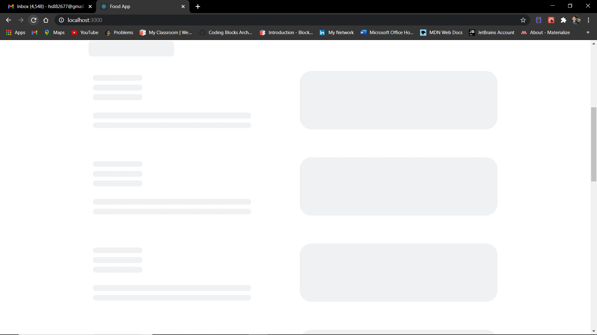

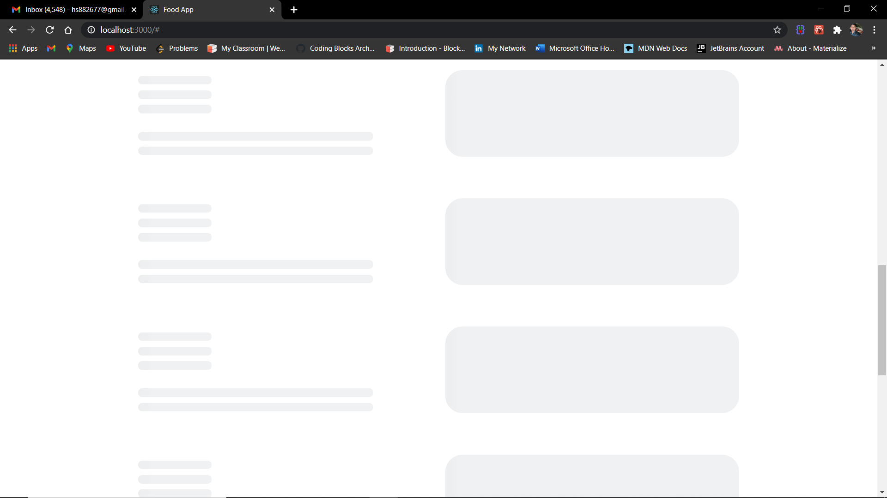

#### `Image 4-6: Home Page Content`

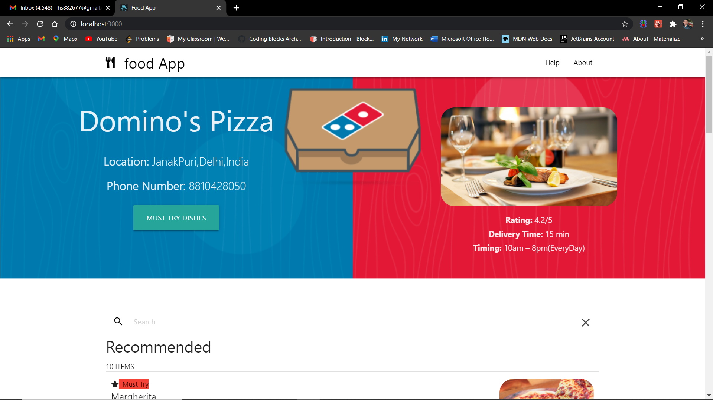

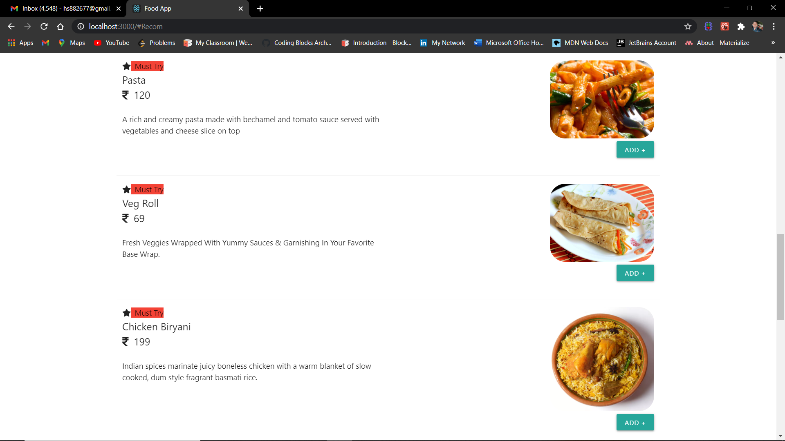

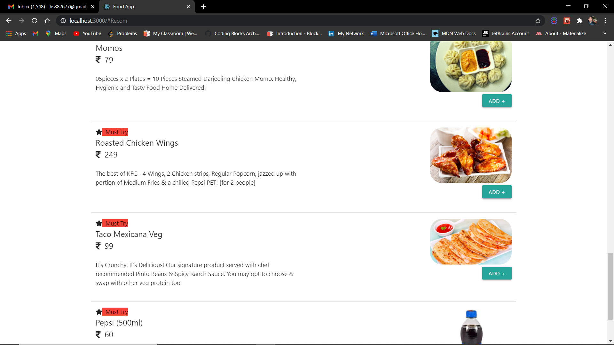

#### `Image 7-8: Displaying Notification PopUp`

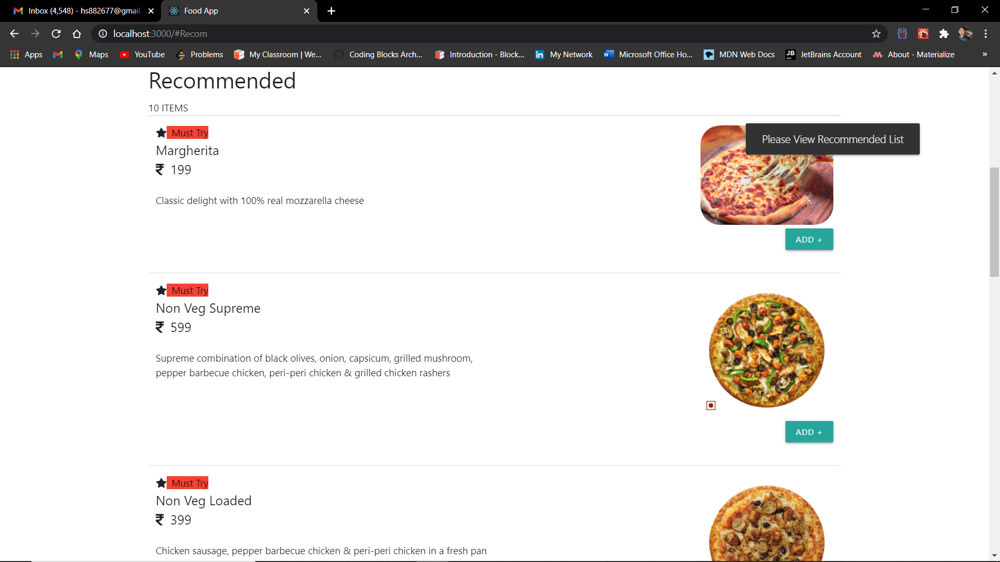

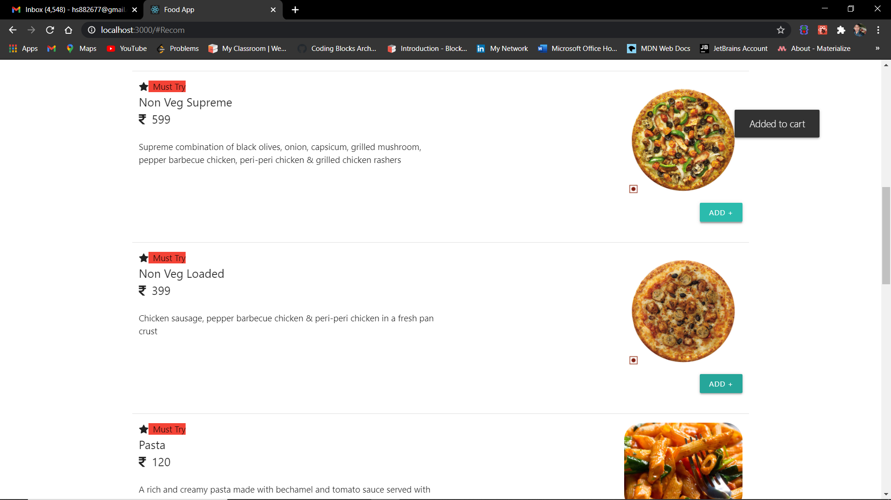

### `Mobile View` :iphone:

#### `Image 9-11: Shimmer Effect (Responsive)`

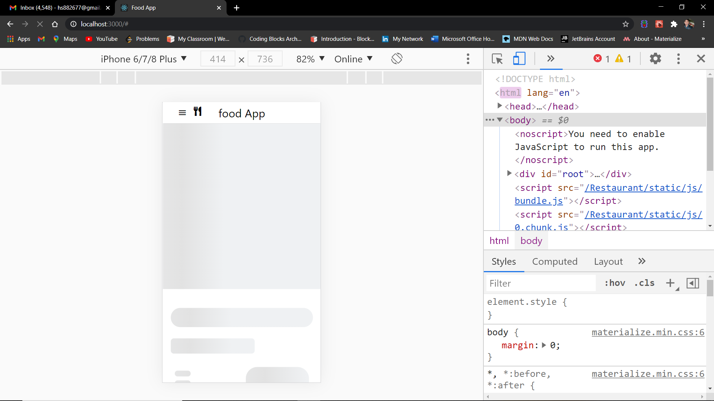

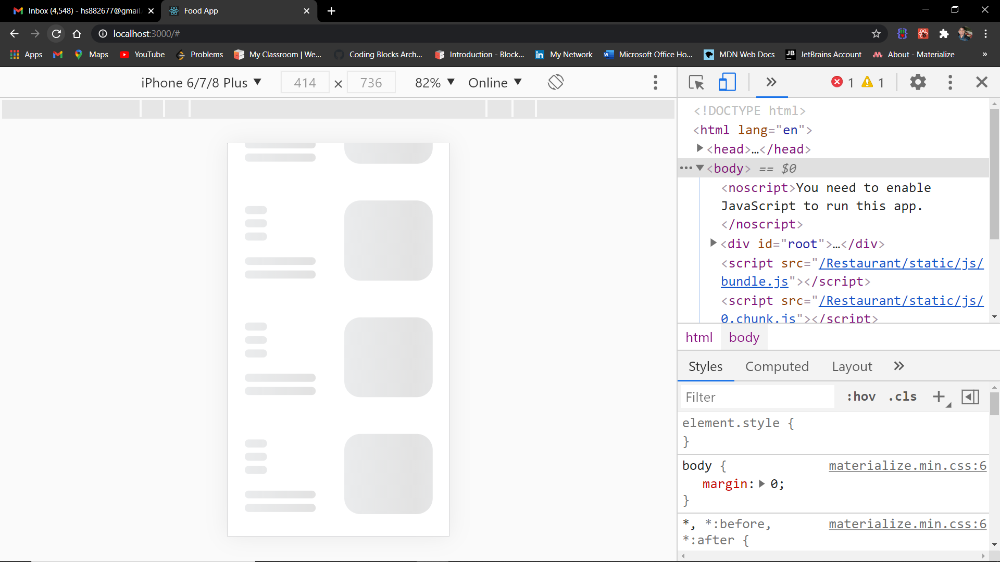

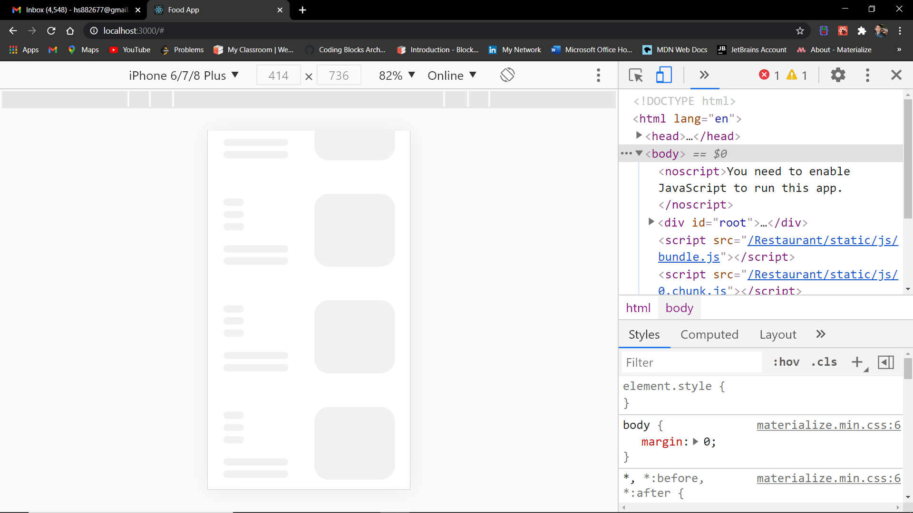

#### `Image 12: Menu-Toggle (Responsive)`

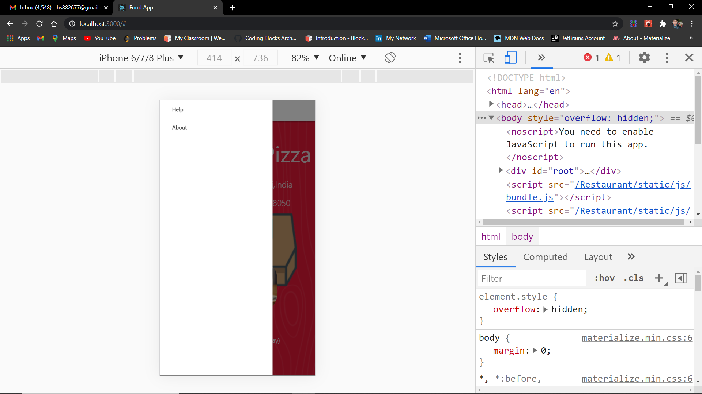

#### `Image 13-16: Home Page Content(Responsive)`

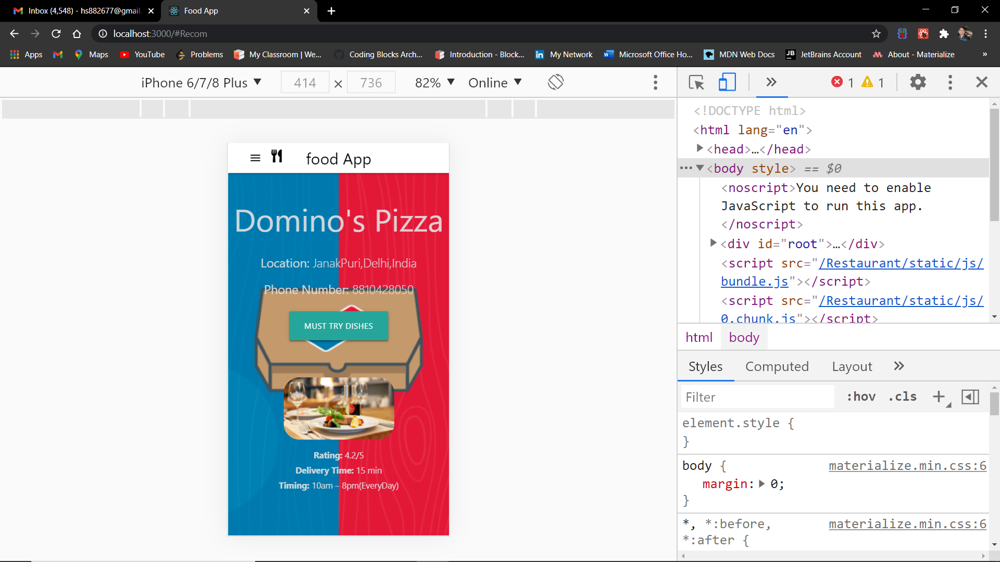

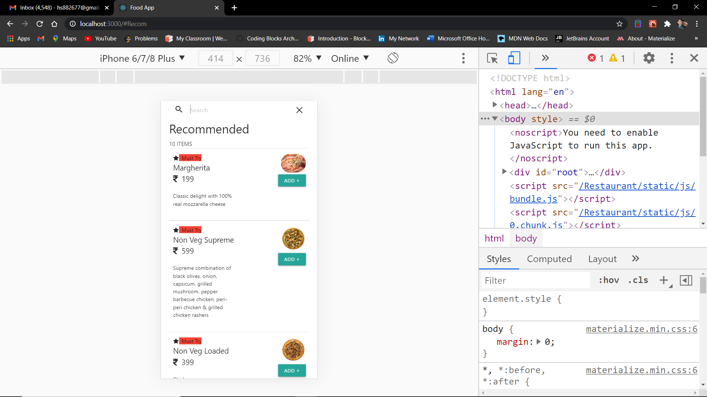

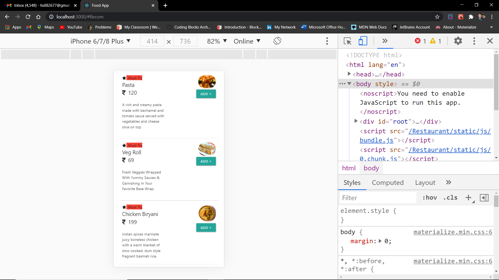

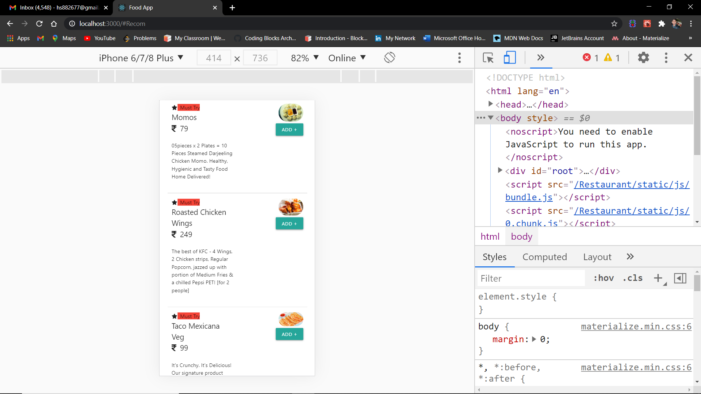

#### `Image 17-18: Displaying Notification PopUp(Responsive)`

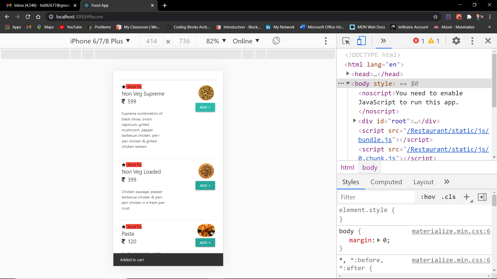

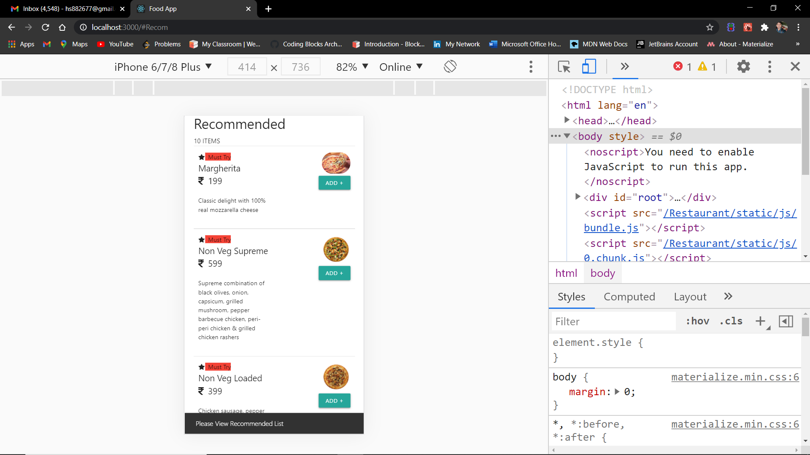

### `Thanks You` :raised_hands:
